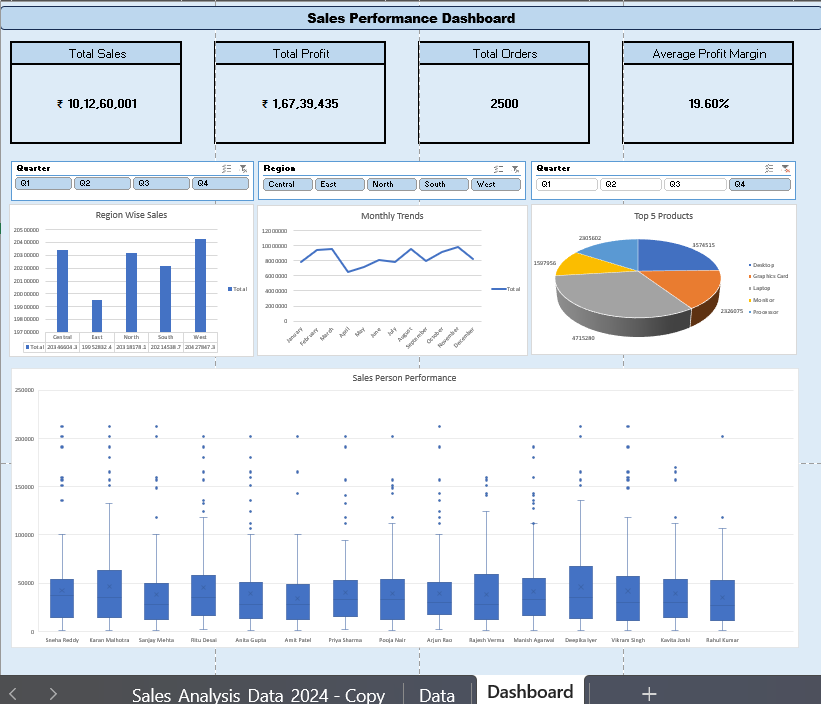

# 📊 Sales Data Analysis & Dashboard — Excel 2024

## 🗂️ Project Overview
An end-to-end **Sales Data Analysis** project built entirely in **Microsoft Excel**, analyzing 2,500 
sales transactions across 12 months (January–December 2024). The project includes data cleaning, 
calculated fields, Pivot Table analysis, and an interactive KPI Dashboard.

## 📸 Dashboard Preview

---

## 📁 Dataset Details
| Field | Details |
|---|---|
| Total Records | 2,500 rows |
| Total Columns | 25 columns |
| Time Period | Jan 2024 – Dec 2024 |
| Total Revenue | ₹10.1 Crore+ |
| Avg Profit Margin | ~19.6% |

---

## 📌 Key Dimensions Analyzed
- **5 Regions** — Central, East, North, West, South
- **9 Product Categories** — Computers, Networking, Audio, Storage, Displays, Peripherals,
   Accessories, Components, Office Equipment
- **3 Customer Segments** — Retail, Corporate, Wholesale
- **5 Payment Methods** — Cash, UPI, Credit Card, Debit Card, Net Banking
- **Delivery Status** — Delivered, Pending, Cancelled

---

## 🧮 Calculated Fields / Columns
| Column | Description |
|---|---|
| Gross Sales | Quantity × Unit Price |
| Discount Amount | Gross Sales × Discount % |
| Sales After Discount | Gross Sales − Discount Amount |
| Tax Amount | Sales After Discount × Tax % |
| Profit | Sales − Cost |
| Profit Margin % | (Profit / Sales) × 100 |
| Total Sales | Final revenue after tax & discount |

---

## 📊 What's Inside the Excel File
| Sheet | Description |
|---|---|
| Sales_Analysis_Data | Raw data with all 25 columns and calculated fields |
| Data | Pivot Table summaries by Region, Category, Quarter |
| Dashboard | Interactive KPI Dashboard with charts and metrics |

---

## 🛠️ Tools & Skills Used
- **Microsoft Excel** — Primary tool
- **Pivot Tables** — Multi-dimensional data summarization
- **Dashboard Design** — KPI cards, charts, slicers
- **Data Cleaning** — Handling formats, calculated columns
- **Sales Analytics** — Business metrics & trend analysis

---

## 💡 Key Insights
- Total revenue crossed **₹10.1 Crore** across all regions in 2024
- Average profit margin maintained at **~19.6%** across all categories
- Regional breakdown shows **Central and East** as top-performing zones
- Multiple payment methods tracked to understand customer preferences

---

## 🚀 How to Use
1. Download the `Salesdata.xlsx` file
2. Open in **Microsoft Excel** (2016 or later recommended)
3. Navigate to the **Dashboard** sheet to view KPIs
4. Use the **Data** sheet to explore Pivot Table summaries
5. Filter by Region, Category, or Month using slicers

---

## 👤 Author
**Chanchalla Manju**
📧 manjuchanchalla@gmail.com
🔗 www.linkedin.com/in/chanchalla-manju-0688062a3

---

## 📌 Tags
`Excel` `Data Analysis` `Sales Analytics` `Dashboard` `Pivot Tables` 
`Business Intelligence` `KPI` `Data Cleaning` `Portfolio Project`
